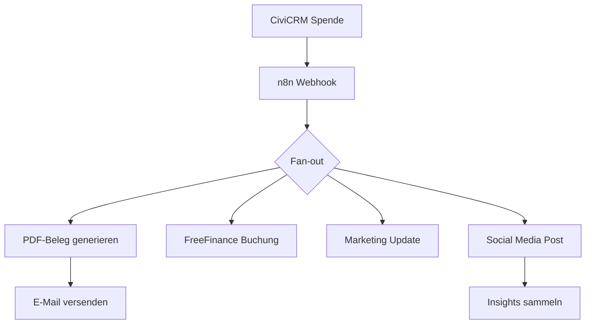

# CiviCRM n8n Integration - README

## 🚀 End-to-End Workflow für Spendenprozesse

Dieses Repository enthält eine vollständige Implementierung eines automatisierten Spendenprozesses für **Menschlichkeit Österreich**, der von CiviCRM-Webhooks ausgelöst wird und verschiedene Services orchestriert.

### 📋 Überblick



### 🛠️ Technologie-Stack

| Komponente | Technologie | Version | Zweck |
|------------|-------------|---------|-------|
| **Orchestrierung** | n8n | 1.41+ | Workflow-Engine mit Queue-Mode |
| **Datenbank** | PostgreSQL | 15+ | Persistierung & Skalierung |
| **Queue** | Redis | 7+ | Asynchrone Verarbeitung |
| **PDF-Generation** | CraftMyPDF | API v1 | DSGVO-konforme Belege |
| **E-Mail** | Brevo | SMTP | Transaktionale E-Mails |
| **Buchhaltung** | FreeFinance | API v1.1 | Automatische Verbuchung |
| **Social Media** | Meta Graph API | v23.0 | Facebook/Instagram Posts |
| **Marketing** | HubSpot/LinkedIn | Latest | CRM-Integration |

### 📁 Repository-Struktur

```
menschlichkeit-workflows/
├── workflows/               # n8n Workflow-Definitionen (JSON)
│   ├── civicrm-donation-workflow.json
│   ├── error-handler-workflow.json
│   └── token-refresh-workflow.json
├── templates/               # PDF- & E-Mail-Templates
│   └── donation-receipt-template.html
├── scripts/                 # Automatisierung & Migration
│   ├── token-refresh.sh
│   └── migrate-civicrm.sh
├── tests/                   # Automatisierte Tests
│   ├── workflows.test.js
│   └── payloads/           # Test-Daten
├── docs/                    # Dokumentation
│   ├── architecture/       # ADRs, DPIA
│   └── GO-LIVE-CHECKLIST.md
└── .github/workflows/       # CI/CD Pipeline
```

## 🔧 Setup & Installation

### 1. Voraussetzungen

```bash
# Node.js & npm
node --version  # >= 20.x
npm --version   # >= 10.x

# PostgreSQL
psql --version  # >= 15.x

# Redis
redis-server --version  # >= 7.x

# Optional: Docker für lokale Entwicklung
docker --version
docker-compose --version
```

### 2. Umgebungsvariablen

```bash
# Kopiere und konfiguriere Environment-Datei
cp .env.example .env
# Bearbeite .env mit deinen API-Keys und Zugangsdaten
```

### 3. Installation

```bash
# Repository klonen
git clone https://github.com/your-org/menschlichkeit-workflows.git
cd menschlichkeit-workflows

# Dependencies installieren
npm install

# n8n global installieren
npm install -g n8n@1.41.0

# CiviCRM Migration ausführen
chmod +x scripts/migrate-civicrm.sh
./scripts/migrate-civicrm.sh
```

### 4. n8n konfigurieren

```bash
# Datenbank initialisieren
n8n db:init

# n8n in Queue-Mode starten
n8n start --queue

# In separatem Terminal: Worker starten
n8n worker --queue
```

### 5. Workflows importieren

```bash
# Alle Workflows importieren
n8n import:workflow --input workflows --yes

# Webhook-Endpunkt testen
curl -X POST http://localhost:5678/webhook-test/civicrm-contribution \
     -H "Content-Type: application/json" \
     -d @tests/payloads/contribution.json
```

## ⚙️ Konfiguration

### CiviCRM Custom Fields

Die folgenden Custom Fields werden automatisch erstellt:

```php
// Workflow Status
'workflow_status' => [
    'type' => 'String',
    'options' => ['pending', 'processing', 'completed', 'failed']
]

// FreeFinance Voucher ID
'ff_voucher_id' => [
    'type' => 'String',
    'label' => 'FreeFinance Voucher ID'
]

// Social Media Reach
'sm_reach' => [
    'type' => 'Integer',
    'label' => 'Social Media Reach'
]
```

### Social Media APIs

#### Facebook/Meta Setup
```bash
# App-Review für folgende Permissions erforderlich:
# - pages_manage_posts
# - instagram_content_publish
# - pages_read_engagement

# Graph API Version
FB_GRAPH_VERSION=v23.0
```

#### LinkedIn Setup
```bash
# Business-Verifizierung erforderlich
# API-Version Header
LINKEDIN_VERSION=202506
```

## 🧪 Testing

### Unit Tests
```bash
# Alle Tests ausführen
npm run test:workflows

# Tests mit UI
npm run test:workflows:ui

# Spezifische Test-Suite
npx playwright test tests/workflows.test.js --grep "PDF Generation"
```

### End-to-End Tests
```bash
# Lokale Testumgebung starten
npm run dev

# E2E Tests in separatem Terminal
npm run test:workflows:e2e
```

### Load Testing
```bash
# Webhook-Endpunkt unter Last testen
npm run test:load
```

## 📊 Monitoring & Logging

### Error Handling
- **Rate Limiting**: Exponentielles Backoff für 429/613 Fehler
- **Token Refresh**: Automatisch nächtlich um 2:00 Uhr
- **Jira Integration**: Automatische Ticket-Erstellung für kritische Fehler
- **CiviCRM Logging**: Fehler werden in Custom Fields gespeichert

### Metriken
```javascript
// Beispiel-Metriken im n8n Dashboard
{
  "daily_donations": 45,
  "pdf_generation_success_rate": 99.2,
  "email_delivery_rate": 98.8,
  "social_media_reach": 12500,
  "avg_processing_time": "3.2s"
}
```

## 🔒 Sicherheit & DSGVO

### Datenschutz
- **Anonymisierung**: Keine personenbezogenen Daten in Social Media
- **Aufbewahrung**: Automatische Löschung nach 7 Jahren (BAO)
- **Opt-out**: Mechanismen in allen E-Mails
- **Verschlüsselung**: TLS 1.3 für alle API-Verbindungen

### Compliance
- ✅ **DSGVO-Folgenabschätzung** durchgeführt
- ✅ **Auftragsverarbeiterverträge** mit allen Anbietern
- ✅ **PDF-UA-Konformität** für Barrierefreiheit
- ✅ **Penetration Testing** jährlich

## 🚀 Deployment

### Staging
```bash
# Staging-Deployment
git push origin develop

# Automatische Tests + Deployment via GitHub Actions
```

### Production
```bash
# Production-Release
git push origin main
git tag v1.0.0
git push origin v1.0.0

# Automatisches Deployment + GitHub Release
```

### Rollback
```bash
# Rollback zu vorheriger Version
git revert HEAD
git push origin main

# Oder: Manueller Rollback
n8n import:workflow --input backups/v0.9.0/ --overwrite
```

---

## 🚀 Go-Live Quickstart (Production)

**1. Voraussetzungen:**
- Kubernetes Cluster (v1.28+), Helm 3.12+, kubectl, SOPS, age
- Zugang zu Container Registry, API-Credentials für alle Services

**2. Produktions-Setup:**
- Siehe `GO-LIVE-CHECKLIST.md` und `GO-LIVE-ROADMAP.md` für alle Schritte
- Helm Chart für n8n mit Queue-Mode deployen
- Monitoring Stack (Prometheus, Grafana, Loki, Alertmanager) einrichten
- CiviCRM 5.82+ mit allen Extensions und Custom Fields konfigurieren
- API-User und Webhook-Endpunkte produktiv setzen

**3. Tests & Validierung:**
- End-to-End-Tests auf Staging-Umgebung durchführen
- 39/39 Workflow-Tests und 2/2 PHP-Tests müssen bestehen
- Business-Akzeptanz und Security-Audit dokumentieren

**4. Go-Live Execution:**
- DNS-Umstellung, Smoke-Tests, Monitoring aktivieren
- 24h intensive Überwachung nach Go-Live
- Rollback- und Recovery-Plan bereit halten (siehe Checkliste)

**5. Management-Entscheidung:**
- Executive Summary und Roadmap für Go/No-Go Entscheidung nutzen

**Weitere Details:**
- Siehe `INSTALLATION_VALIDATION_REPORT.md` für technische Validierung
- Siehe `EXECUTIVE_SUMMARY_GO_LIVE.md` für Management-Übersicht

## 📞 Support

### Troubleshooting

| Problem | Lösung |
|---------|--------|
| **Webhook-Timeouts** | Überprüfe n8n Worker-Status |
| **PDF-Generation fehlgeschlagen** | Validiere CraftMyPDF-Template |
| **E-Mail nicht angekommen** | Prüfe Brevo-Kontingent |
| **Social Media-Fehler** | Token-Refresh ausführen |

### Logs einsehen
```bash
# n8n Logs
tail -f ~/.n8n/logs/n8n.log

# Script-Logs
tail -f logs/migration.log
tail -f logs/token-refresh.log
```

### Support-Kontakt
- **DevOps Team**: devops@menschlichkeit.at
- **Emergency**: +43 xxx xxx xxxx
- **Jira**: https://menschlichkeit.atlassian.net/

## 🤝 Contributing

### Development Workflow
```bash
# Feature-Branch erstellen
git checkout -b feature/new-workflow

# Änderungen committen
git commit -m "feat: add new donation workflow"

# Pull Request erstellen
git push origin feature/new-workflow
```

### Code Standards
- **ESLint**: Automatische Code-Formatierung
- **Tests**: Mindestens 80% Coverage
- **Dokumentation**: Alle neuen Features dokumentieren

## 📄 Lizenz

MIT License - siehe [LICENSE](LICENSE) für Details.

---

**Erstellt mit ❤️ für Menschlichkeit Österreich**

Für Fragen oder Support: [devops@menschlichkeit.at](mailto:devops@menschlichkeit.at)
