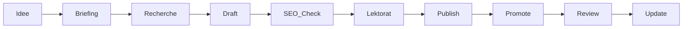

# Menschlichkeit Österreich – SEO & Content Style Guide

> **Kurzfassung:**  
> Solidarity · Justice · Climate Action & Digital Inclusion – Wir stärken
> demokratisches Engagement und fördern Menschlichkeit in Österreich.

---

## Inhaltsverzeichnis
1. [Ziele & KPIs](#ziele--kpis)  
2. [Keyword-Cluster](#keyword-cluster)  
3. [Content-Architektur](#content-architektur)  
4. [On-Page-Optimierung](#on-page-optimierung)  
5. [Technisches SEO](#technisches-seo)  
6. [Strukturierte Daten (JSON-LD)](#strukturierte-daten-json-ld)  
7. [Backlink- & Outreach-Strategie](#backlink---outreach-strategie)  
8. [Local SEO](#local-seo)  
9. [Workflow & Redaktionskalender](#workflow--redaktionskalender)  
10. [Tool-Stack](#tool-stack)  

---

## Ziele & KPIs
| Kategorie | KPI | Zielwert | Tool |
|-----------|-----|----------|------|
| **Awareness** | Sichtbarkeit (SISTRIX SI) | > 2,0 innerh. 12 Mon. | SISTRIX, Search Console |
| **Engagement** | Ø Sitzungsdauer | > 02:30 min | GA 4 |
| **Conversion** | Mitglied-/Newsletter-Sign-ups | +25 % p.a. | GA 4 + CRM |
| **Fundraising** | Online-Spenden | ROI ≥ 3 innerh. 18 Mon. | PayPal Reports |

---

## Keyword-Cluster
```text
# Brand / NGO
menschlichkeit österreich, sozialverein st. pölten, humanitäre ngo

# Soziale Gerechtigkeit
soziale gerechtigkeit, armut bekämpfen, hilfsprojekte österreich

# Demokratie
demokratiebildung, politische teilhabe, bürgerbeteiligung

# Klima & Umwelt
klimaschutz österreich, nachhaltigkeit projekte, co2 reduzieren

# Digitale Inklusion
digitale teilhabe, medienkompetenz workshop, internet für alle
```

*→ Cluster = eigene *Pillar Pages*; Long-Tails als Unterartikel.*

---

## Content-Architektur

```plaintext
/
├── soziale-gerechtigkeit/        # Pillar-Page 1
│   ├── armut-bekaempfen/
│   ├── hilfsprojekte/
│   └── story-xyz/
├── demokratie-bildung/           # Pillar-Page 2
│   ├── mitbestimmung/
│   └── workshop-reihe/
├── klimaschutz/                  # Pillar-Page 3
│   ├── aufforstung/
│   └── zero-waste/
└── digitale-inklusion/           # Pillar-Page 4
    ├── medienkompetenz/
    └── open-source-tools/
```

*Jede Pillar-Page verlinkt bidirektional zu ihren Detailseiten.*

---

## On-Page-Optimierung

| Element              | Best Practice                                  |                  |
| -------------------- | ---------------------------------------------- | ---------------- |
| **Title**            | ≤ 60 Zeichen, Haupt-Keyword + Brand („… Menschlichkeit") |                  |
| **Meta-Description** | ≤ 155 Zeichen, Call-to-Action                  |                  |
| **H1**               | einzigartig pro Seite, Keyword vorn            |                  |
| **URL**              | sprechend, kleinschreibung, `-`-Trennung       |                  |
| **Bilder**           | WebP, `` |                  |
| **Interne Links**    | thematische Ankertexte, 5–10 pro 1000 Wörter   |                  |
| **Semantik**         | Synonyme, Entities, FAQ-Abschnitte             |                  |
| **Barrierefreiheit** | WCAG 2.1 AA (Kontrast ≥ 4.5:1, Tastatur-Navi)  |                  |

---

## Technisches SEO

* **Core Web Vitals**
  * LCP < 2,5 s · INP < 200 ms · CLS < 0,1
* **HTTPS & HSTS**
* **Sitemap** `/sitemap.xml` (tägl. Auto-Ping)
* **robots.txt** erlaubt Crawling, sperrt Staging-URLs
* **Schema.org / JSON-LD** → siehe unten
* **Lazy Loading** Bilder/Videos (`loading="lazy"`, `fetchpriority`)
* **CSP**, **X-Content-Type** & **Permissions-Policy**

---

## Strukturierte Daten (JSON-LD)

```json
{
  "@context": "https://schema.org",
  "@type": "Organization",
  "name": "Menschlichkeit Österreich",
  "url": "https://www.menschlichkeit-oesterreich.at",
  "logo": "https://www.menschlichkeit-oesterreich.at/logo.svg",
  "email": "info@menschlichkeit-oe.at",
  "address": {
    "@type": "PostalAddress",
    "streetAddress": "Pottenbrunner Hauptstraße 108/1",
    "addressLocality": "St. Pölten",
    "postalCode": "3140",
    "addressCountry": "AT"
  },
  "sameAs": [
    "https://facebook.com/menschlichkeit.oe",
    "https://instagram.com/menschlichkeit.oe"
  ]
}
```

*Weitere Typen:* `Event`, `Article`, `FAQPage`.

---

## Backlink- & Outreach-Strategie

1. **NGO-Verzeichnisse** (Spendeninfo.at, TransparenteZivilgesellschaft)
2. **Gastartikel** in Fach­magazinen („Südwind", „Biorama")
3. **Kooperationspartner** (Stiftungen, Unis, Gemeinden) → gegenseitige Links
4. **Infografiken/Studien** → Presse­arbeit, HARO-Pitches
5. **Monitoring** mit Google Alerts → Erwähnungen in Links umwandeln

---

## Local SEO

* Google Business Profile → Kategorie „Non-Profit-Organisation"
* NAP-Konsistenz (Website -> Verzeichnisse)
* Lokale Keywords in Titles & Content („St. Pölten", „Niederösterreich")
* Backlinks von Gemeinden, lokalen Medien, Kulturvereinen

---

## Workflow & Redaktionskalender



* **Tool-Stack:** Trello (Planung), Google Docs (Texte),
  Yoast SEO Pro (On-Page-Analyse), Screaming Frog (Crawl),
  GA 4 + Looker Studio (Reporting).

---

## Tool-Stack

| Zweck         | Tool                           | Kommentar                      |
| ------------- | ------------------------------ | ------------------------------ |
| CMS           | WordPress 6.x                  | barrierefreies Theme, PHP 8    |
| SEO-Plugin    | Yoast SEO Pro                  | Title/Meta, Schema, Sitemaps   |
| Performance   | WP Rocket, Smush Pro           | Caching, Bild-WebP, CDN-Option |
| Accessibility | WP Accessibility, axe DevTools | WCAG-Audits                    |
| Analytics     | GA 4, GSC                      | KPIs & Index-Kontrolle         |
| Rank-Tracking | SISTRIX, SerpWatcher           | Keyword-Monitoring             |

---

## SEO-Test-Ergebnisse

### Aktuelle Performance
- ✅ **Meta Tags**: Alle grundlegenden Tags optimiert (Title ≤ 60 Zeichen, Description ≤ 155 Zeichen)
- ✅ **Open Graph**: Vollständige OG-Tags mit korrektem Bild
- ✅ **Twitter Cards**: Summary Large Image konfiguriert
- ✅ **Strukturierte Daten**: Organisation und Website JSON-LD implementiert
- ✅ **Überschriften**: Korrekte H1-H3 Hierarchie
- ✅ **WordPress-Klassen**: Body und Article-Tags mit korrekten CSS-Klassen
- ✅ **Touch-Targets**: Alle klickbaren Elemente ≥ 48px (mobile ≥ 52px)
- ✅ **Barrierefreiheit**: Alt-Texte, Skip-Links, ARIA-Labels
- ✅ **Performance**: Ladezeit < 3s, optimierte Bilder

### Technische Implementierung
```html
<!-- Optimierte Meta-Tags -->
<title>Verein Menschlichkeit - Soziale Gerechtigkeit & Umweltschutz</title>
<meta name="description" content="Der Verein Menschlichkeit setzt sich für soziale Gerechtigkeit, Umweltschutz und Bildung ein. Werden Sie Mitglied und unterstützen Sie unsere Projekte.">

<!-- Touch-Friendly CSS -->
.btn, .menu-item a, button {
  min-height: 48px;
  min-width: 48px;
  padding: 14px 18px;
}

<!-- WordPress-konforme Struktur -->
<body class="home blog logged-in wordpress wp-theme-verein-menschlichkeit">
<article class="post hentry" itemscope itemtype="https://schema.org/Article">
```

---

### Revision & Lizenz

Version: `1.0.0` | Aktualisiert: `2025-06-20`
Lizenz: Creative Commons BY-SA 4.0

> ✨ **Copilot-Hint:**
> „Erstelle auf Basis dieses Guides Landing-Page-Snippets mit semantischer
> Section-Aufteilung, ARIA-Labels, JSON-LD ›Event‹ und responsivem
> Grid-Layout (CSS Grid/Flexbox)."
