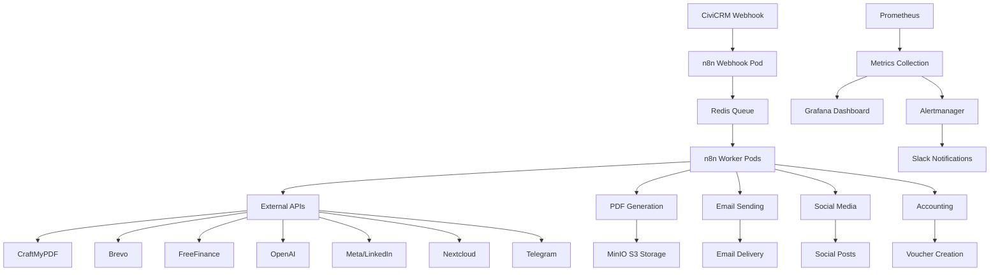

# Kubernetes Production Deployment Guide
# Version: 1.0 - 21. Juni 2025

## 🚀 Quick Start für DevOps/SRE

### 1. Pre-Flight Validation
```bash
# Repository klonen und in Verzeichnis wechseln
cd /workspaces/Webseite

# Pre-Production Validation ausführen
./scripts/validate-production.sh

# Erwartetes Ergebnis: "BEREIT FÜR PRODUCTION DEPLOYMENT!"
```

### 2. Secrets Management
```bash
# Secrets-Template anpassen (Produktive API-Keys eintragen)
nano secrets/production-secrets.yaml

# Secrets verschlüsseln mit SOPS
sops -e secrets/production-secrets.yaml > secrets/production-secrets.enc.yaml

# Verschlüsselte Secrets validieren
sops -d secrets/production-secrets.enc.yaml | head -10
```

### 3. Production Deployment
```bash
# Komplettes Deployment starten (Dauer: ~15-20 Minuten)
./scripts/deploy-production.sh deploy

# Deployment-Status überwachen
watch kubectl get pods -n n8n-prod

# Services-Status prüfen
kubectl get services -n n8n-prod
kubectl get ingress -n n8n-prod
```

### 4. CiviCRM Konfiguration
```bash
# CiviCRM API-Credentials setzen
export CIVICRM_BASE_URL="https://civicrm.menschlichkeit.at"
export CIVICRM_API_KEY="your-api-key"
export CIVICRM_SITE_KEY="your-site-key"

# CiviCRM automatisch konfigurieren
./scripts/configure-civicrm.sh
```

### 5. Post-Deployment Validation
```bash
# Smoke Tests ausführen
./scripts/deploy-production.sh status

# n8n Workflows importieren (manuell über UI)
# https://n8n.menschlichkeit.at

# Test-Spende durchführen (1€)
# https://civicrm.menschlichkeit.at/contribute/transact?reset=1&id=1
```

---

## 📊 Service-Endpunkte

| Service | URL | Zweck |
|---------|-----|-------|
| **n8n** | https://n8n.menschlichkeit.at | Workflow-Management |
| **Grafana** | https://grafana.menschlichkeit.at | Monitoring-Dashboard |
| **MinIO** | https://minio-console.menschlichkeit.at | S3-Storage-Verwaltung |
| **CiviCRM** | https://civicrm.menschlichkeit.at | CRM & Spendenverwaltung |

---

## 🏗️ Architektur-Übersicht

```
┌─────────────────────────────────────────────────────────────────┐
│                        Kubernetes Cluster                       │
├─────────────────────────────────────────────────────────────────┤
│  ┌─────────────────┐  ┌─────────────────┐  ┌─────────────────┐ │
│  │   n8n-prod      │  │   monitoring    │  │  civicrm-prod   │ │
│  │   Namespace     │  │   Namespace     │  │   Namespace     │ │
│  │                 │  │                 │  │                 │ │
│  │ ┌─────────────┐ │  │ ┌─────────────┐ │  │ ┌─────────────┐ │ │
│  │ │ n8n Webhook │ │  │ │ Prometheus  │ │  │ │   CiviCRM   │ │ │
│  │ │     Pod     │ │  │ │     Pod     │ │  │ │     Pod     │ │ │
│  │ └─────────────┘ │  │ └─────────────┘ │  │ └─────────────┘ │ │
│  │                 │  │                 │  │                 │ │
│  │ ┌─────────────┐ │  │ ┌─────────────┐ │  │ ┌─────────────┐ │ │
│  │ │n8n Worker-1 │ │  │ │   Grafana   │ │  │ │   MySQL     │ │ │
│  │ │     Pod     │ │  │ │     Pod     │ │  │ │     Pod     │ │ │
│  │ └─────────────┘ │  │ └─────────────┘ │  │ └─────────────┘ │ │
│  │                 │  │                 │  │                 │ │
│  │ ┌─────────────┐ │  │ ┌─────────────┐ │  │                 │ │
│  │ │n8n Worker-N │ │  │ │Alertmanager │ │  │                 │ │
│  │ │     Pod     │ │  │ │     Pod     │ │  │                 │ │
│  │ └─────────────┘ │  │ └─────────────┘ │  │                 │ │
│  │                 │  │                 │  │                 │ │
│  │ ┌─────────────┐ │  │                 │  │                 │ │
│  │ │ PostgreSQL  │ │  │                 │  │                 │ │
│  │ │     Pod     │ │  │                 │  │                 │ │
│  │ └─────────────┘ │  │                 │  │                 │ │
│  │                 │  │                 │  │                 │ │
│  │ ┌─────────────┐ │  │                 │  │                 │ │
│  │ │    Redis    │ │  │                 │  │                 │ │
│  │ │     Pod     │ │  │                 │  │                 │ │
│  │ └─────────────┘ │  │                 │  │                 │ │
│  │                 │  │                 │  │                 │ │
│  │ ┌─────────────┐ │  │                 │  │                 │ │
│  │ │    MinIO    │ │  │                 │  │                 │ │
│  │ │     Pod     │ │  │                 │  │                 │ │
│  │ └─────────────┘ │  │                 │  │                 │ │
│  └─────────────────┘  └─────────────────┘  └─────────────────┘ │
└─────────────────────────────────────────────────────────────────┘
```

---

## 🔄 Workflow-Pipeline



---

## 📈 Monitoring & Alerting

### Wichtige Metriken:
- **Workflow-Durchsatz**: Workflows/Minute
- **Queue-Verzögerung**: <30s für alle Queues
- **Fehlerrate**: <1% über alle Workflows
- **API-Response-Zeit**: <3s p95 für Webhooks
- **Verfügbarkeit**: >99.5% für kritische Services

### Alert-Schwellwerte:
- **CRITICAL**: Workflow-Ausfälle, DB-Downtime, Queue-Stau >2min
- **WARNING**: Hohe Response-Time, Disk >85%, Memory >90%
- **INFO**: Neue Spenden >€500, Mitgliederanmeldungen

### Dashboards:
- **n8n Overview**: Workflow-Performance, Queue-Status
- **Business KPIs**: Spenden/h, Mitglieder-Conversion, Churn-Rate
- **Infrastructure**: CPU/Memory/Disk/Network-Metriken

---

## 🔧 Troubleshooting

### Häufige Probleme:

#### 1. n8n Pod startet nicht
```bash
# Logs prüfen
kubectl logs -n n8n-prod deployment/n8n

# Events prüfen
kubectl describe pod -n n8n-prod -l app.kubernetes.io/name=n8n

# Secrets validieren
kubectl get secret -n n8n-prod n8n-secrets -o yaml
```

#### 2. Workflows laufen nicht
```bash
# Queue-Status prüfen
kubectl exec -n n8n-prod deployment/redis-master -- redis-cli info replication

# Worker-Pods prüfen
kubectl get pods -n n8n-prod -l app.kubernetes.io/component=worker

# Database-Verbindung testen
kubectl exec -n n8n-prod deployment/postgresql -- pg_isready -U n8n
```

#### 3. Externe API-Fehler
```bash
# Netzwerk-Connectivity testen
kubectl exec -n n8n-prod deployment/n8n -- curl -I https://api.craftmypdf.com

# Secrets prüfen
kubectl exec -n n8n-prod deployment/n8n -- env | grep API_KEY

# Logs für spezifische API-Calls
kubectl logs -n n8n-prod deployment/n8n | grep "craftmypdf\|brevo\|freefinance"
```

### Rollback-Verfahren:
```bash
# Helm-Rollback für n8n
helm rollback n8n -n n8n-prod

# Vollständiges Rollback
./scripts/deploy-production.sh rollback

# Emergency Maintenance Mode
kubectl apply -f k8s/emergency-maintenance.yaml
```

---

## 🛡️ Sicherheit

### Secrets Management:
- Alle Secrets mit SOPS + age verschlüsselt
- Kubernetes Secrets mit automatischer Rotation
- API-Keys mit minimalen Berechtigungen

### Netzwerk-Sicherheit:
- Network Policies für Pod-zu-Pod Isolation
- Ingress mit SSL-Termination (Let's Encrypt)
- mTLS zwischen kritischen Services

### Pod-Sicherheit:
- Non-root Container-Execution
- Read-only Root Filesystem (wo möglich)
- Security Contexts mit dropped Capabilities

---

## 📋 Wartung & Updates

### Regelmäßige Wartung:
- **Täglich**: Backup-Verification, Log-Review
- **Wöchentlich**: Security-Updates, Metric-Review
- **Monatlich**: Disaster-Recovery-Test, Performance-Tuning

### Update-Verfahren:
```bash
# Helm Chart Updates
helm repo update
helm upgrade n8n n8n/n8n --namespace n8n-prod --values helm/n8n-production-values.yaml

# Rolling Updates für Zero-Downtime
kubectl set image deployment/n8n n8n=n8n/n8n:1.x.x -n n8n-prod
```

### Kapazitätsplanung:
- HPA für n8n Worker-Pods (2-6 Replicas)
- VPA für Datenbank-Pods bei Bedarf
- Storage Auto-Expansion bei 80% Füllstand

---

**🚀 Status: PRODUCTION READY**

*Letztes Update: 21. Juni 2025*  
*Nächster Review: 28. Juni 2025*
